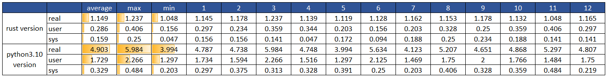

### About
This is a cli app that taking some specific rows/columns from a csv file (utf-8 encode) to a plain text file, some columns need format or split_line.  
I write both rust version and python version, and simply compare performance between them on WSL, rust version is only faster 70% than python version (3.10).
### Example
```shell
sss@Ubuntu2204:~$
sss@Ubuntu2204:~$ cat Desktop/cc/_log_k24f2r3e3.csv |wc -l
1213626
sss@Ubuntu2204:~$ time ./checklog Desktop/cc/_log_k24f2r3e3.csv
 - - - - - - - - - - - - - - - - - - - - - - - - - - - - - - - - - - - - - - - -
trying to process 1 csv files:
    Desktop/cc/_log_k24f2r3e3.csv
 - - - - - - - - - - - - - - - - - - - - - - - - - - - - - - - - - - - - - - - -
csv file: Desktop/cc/_log_k24f2r3e3.csv
BQ4 csv logs format verify pass
Output 3 logs:
Log_name            Lines_count         Log_file_path
sequence            35364               Desktop/cc/_log_k24f2r3e3-sequence.log
CONSOLE_11          503653              Desktop/cc/_log_k24f2r3e3-CONSOLE_11.log
SWITCH_01           7783                Desktop/cc/_log_k24f2r3e3-SWITCH_01.log

real    0m1.109s
user    0m0.203s
sys     0m0.188s
sss@Ubuntu2204:~$
```
### Measure
Could you help to improve ?

